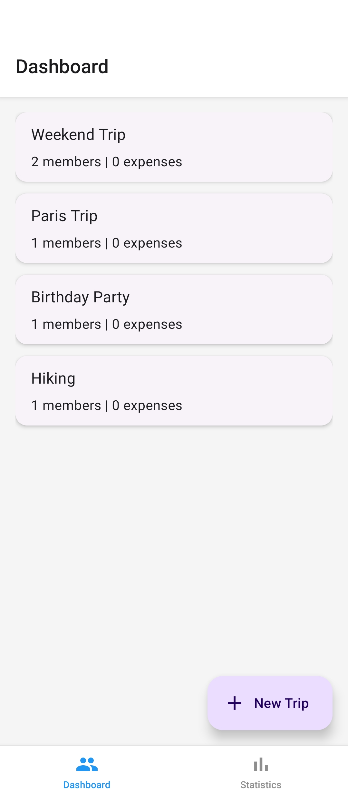

# Split & Track 💸

A React Native (Expo) mobile application designed to help groups of friends manage shared costs, track expenses, and attach receipts and GPS locations to their transactions. Built with TypeScript, Expo Router, and Zustand.

## 📸 Screenshots

| Dashboard | Add Expense (Camera/GPS) | Group Details |
| :---: | :---: | :---: |
| ** | *(Add screenshot 2 here)* | *(Add screenshot 3 here)* |

## ✨ Core Features

* **Group Management:** Organize expenses by trips, events, or flatmates.
* **Native Device Integrations:** Attach receipts using the device Camera or Gallery, and tag exact spending locations using GPS.
* **Offline First:** All data is persisted locally to the device; no internet connection required to view or log expenses.
* **Smart Dashboard:** View total spending across all groups with performant list rendering.
* **Input Validation:** Prevents empty or invalid expense submissions.

## 🛠 Tech Stack

* **Framework:** React Native + Expo
* **Language:** TypeScript
* **Navigation:** Expo Router (File-based routing with Tabs, Stack, and Modals)
* **State Management:** Zustand (with persist middleware)
* **Local Storage:** AsyncStorage
* **UI Components:** React Native Paper
* **Native Modules:** `expo-image-picker`, `expo-location`
* **Testing:** Jest + React Native Testing Library

## 🚀 Setup Instructions

Follow these steps to run the project locally:

1. **Clone the repository:**

   ```bash
   git clone <your-repo-link>
   cd SplitAndTrack
   ```

2. **Install dependencies:**

   ```bash
   npm install
   ```

3. **Start the Expo development server:**

   ```bash
   npx expo start -c
   ```

4. **Run on a device:**

   Download the Expo Go app on your iOS or Android device and scan the QR code generated in your terminal.

## 🧪 Testing

This project includes a comprehensive Jest test suite covering core math utilities and global state logic.

To run the tests:

```bash
npx jest
```

## 📦 Building the APK (Deployment)

This project is configured for EAS (Expo Application Services). To generate a standalone Android .apk:

1. **Install the EAS CLI:**

   ```bash
   npm install -g eas-cli
   ```

2. **Log in to Expo:**

   ```bash
   eas login
   ```

3. **Run the preview build:**

   ```bash
   eas build --platform android --profile preview
   ```

## 📁 Project Structure

```
SplitAndTrack/
├── __tests__/          # Jest test suites
├── app/                # Expo Router screens 
│   ├── (tabs)/         # Tab navigation (Dashboard & Stats)
│   ├── group/          # Dynamic stack routes (Group details)
│   └── modal/          # Presentation modals (Add Expense)
├── constants/          # UI theme and global styling
├── store/              # Zustand global state & AsyncStorage config
├── types/              # TypeScript interfaces (Group, Expense)
└── utils/              # Math utilities for expense calculation
```

## 🎓 Evaluation Criteria Fulfillment (Target: Grade 4.0)

| Criterion | Description | Implementation in Project |
| --- | --- | --- |
| 1 | App Architecture | Clean folder separation (/store, /types, /utils, /app). |
| 2 | Screen Sizes | Uses Flexbox layouts (flex: 1) exclusively; no hardcoded widths. |
| 3 | Code Quality | TypeScript interfaces, consistent naming, ESLint + Prettier rules. |
| 4 | Tests | 8 Jest tests covering math utils and Zustand store state changes. |
| 5 | Documentation | This comprehensive README with setup and tech stack details. |
| 6 | Native Features | Camera/Gallery (expo-image-picker) and Geolocation (expo-location). |
| 7 | Async Ops | async/await used for GPS/Camera with ActivityIndicator loading states. |
| 8 | Navigation | Expo Router implementation featuring Tabs + Stack + Modal. |
| 9 | Performance | FlatList utilized for rendering groups and expenses. |
| 10 | Style & UI/UX | Consistent UI via React Native Paper and a centralized theme.ts. |
| 11 | State Management | Zustand used for clean, scalable global state. |
| 12 | Error Handling | try/catch on GPS; alert dialogs for denied permissions. |
| 13 | Offline Mode | AsyncStorage securely persists Zustand state between sessions. |
| 14 | Security | Form validation prevents bad inputs; no raw API keys in source code. |
| 15 | Deployment | Configured for Android .apk generation via EAS Build. |
